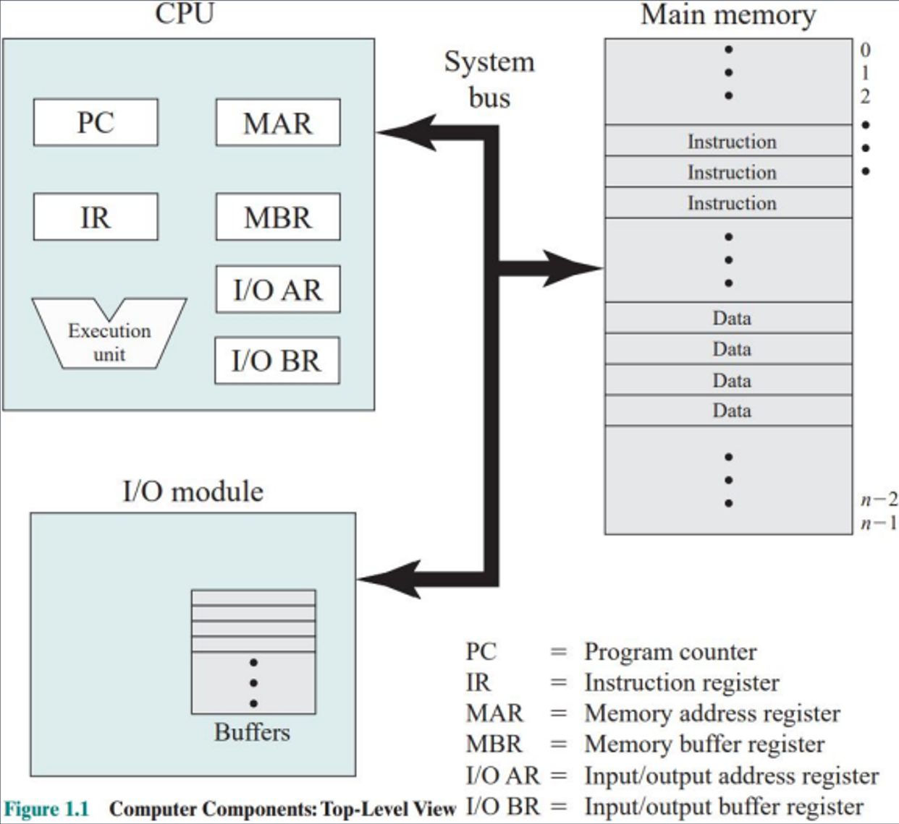
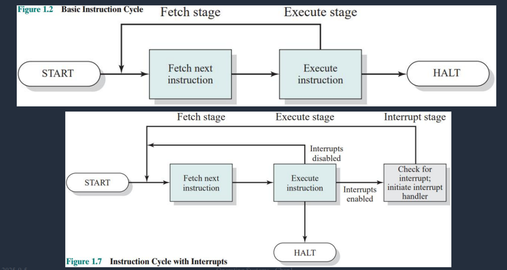
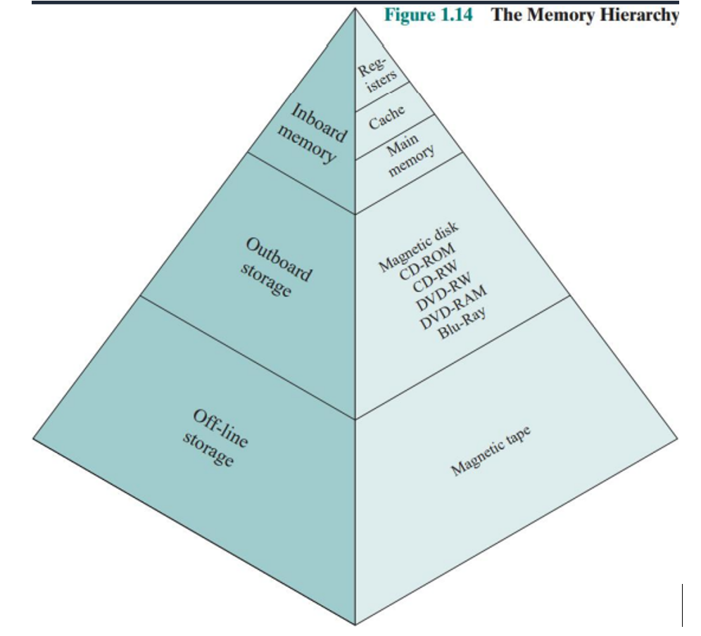
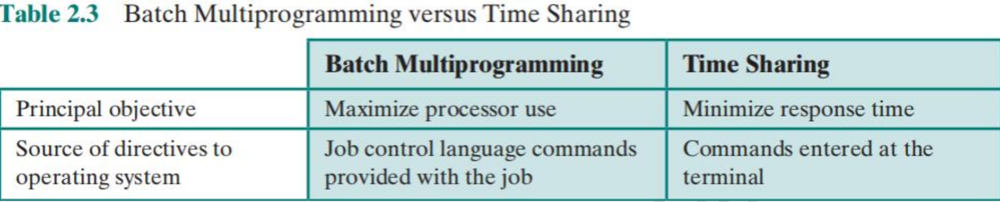
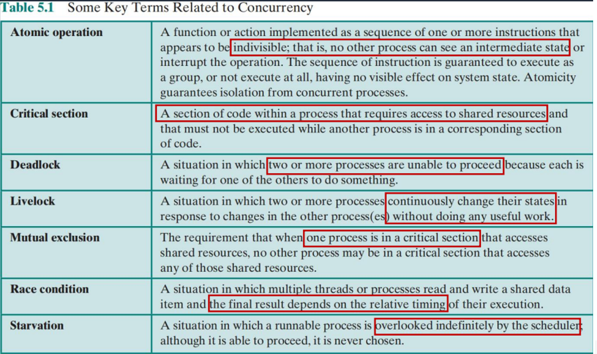
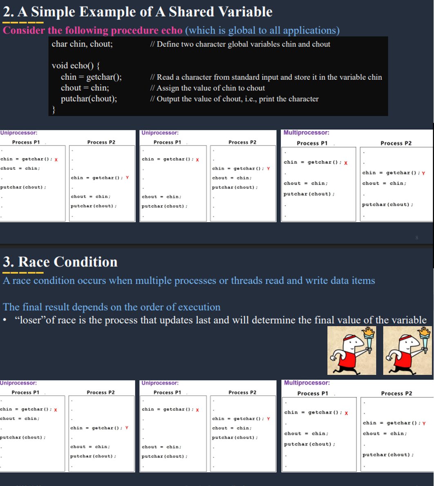
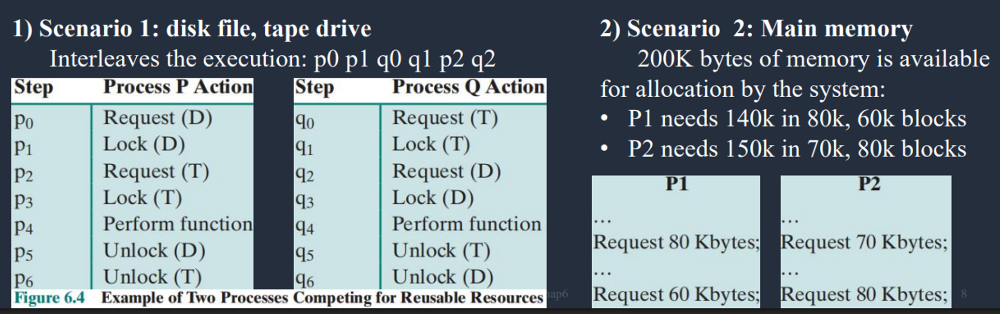
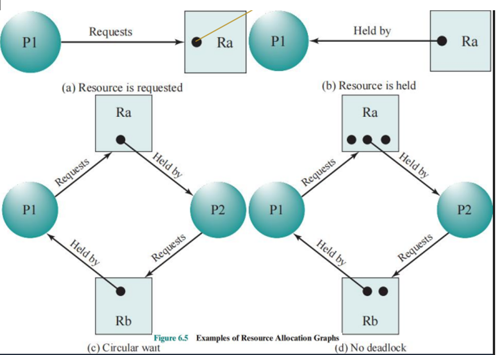
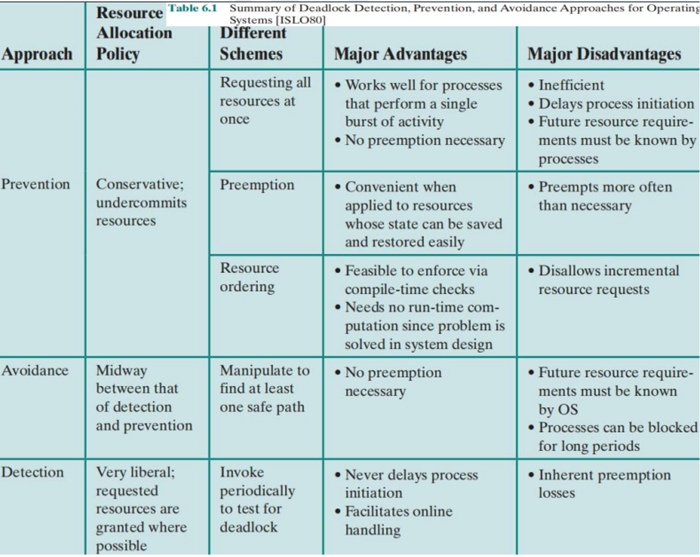

# Operating Systems
## Chapter 1: Introduction to OS

### Q1: What is an Operating System? Give a definition.

**Answer:**
An Operating System (OS) is system software that acts as an intermediary between computer hardware and application software. It manages hardware resources and gives every application the illusion of having its own CPU by timeslicing (switching between applications ~100 times/sec or every 10ms).

---

### Q2: Give examples of popular Operating Systems (at least three).

**Answer:**
1. **Windows** - Most popular desktop OS
2. **Linux/Unix** - Open-source, widely used in servers
3. **macOS** - Apple's desktop OS
4. **Android** - Mobile OS
5. **iOS** - Apple's mobile OS

---

### Q3: What are the similarities and differences between OS and Apps?

**Answer:**

**Similarities:**
- Both are software programs
- Both execute on hardware
- Both serve user needs

**Differences:**
- **OS**: Acts as host/teacher, manages resources, runs in kernel mode
- **Apps**: Acts as guest/student, uses OS services, runs in user mode

**Metaphor:** OS/Apps = Host/Guests = Teacher/Students

---

### Q4: Explain the Basic Elements of a computer system.

**Answer:**



Four main components connected by System Bus:

1. **CPU (Processor):**
   - PC (Program Counter), IR (Instruction Register)
   - MAR (Memory Address Register), MBR (Memory Buffer Register)
   - I/O AR (I/O Address Register), I/O BR (I/O Buffer Register)
   - Execution unit for computation

2. **Main Memory:** Stores instructions and data at numbered addresses

3. **I/O Module:** Manages communication with external devices using buffers

4. **System Bus:** Communication pathway carrying addresses, data, and control signals

---

### Q5: Explain the Interrupt Cycle.

**Answer:**



**Basic Cycle:** START → Fetch instruction → Execute instruction → HALT

**With Interrupts:**
1. Fetch next instruction
2. Execute instruction
3. Check for interrupt (after each instruction)
4. **If interrupt exists:**
   - Save current state (PC, registers)
   - Jump to interrupt handler
   - Execute interrupt service routine
   - Restore saved state
   - Resume execution
5. **If no interrupt:** Continue to next instruction

**Types:** Program (errors), Timer (clock), I/O (device ready), Hardware failure

---

### Q6: Describe the Memory Hierarchy. Which is faster, larger, and costlier?

**Answer:**



**From Top to Bottom (Fastest to Slowest):**
1. **Registers** - Fastest, smallest, most expensive
2. **Cache** - Very fast, small, expensive
3. **Main Memory (RAM)** - Fast, moderate size, moderate cost
4. **Disk** - Slowest, largest, cheapest

**Key Rule:** 
- **Speed:** Registers > Cache > RAM > Disk
- **Size:** Disk > RAM > Cache > Registers
- **Cost/byte:** Registers > Cache > RAM > Disk

---

### Q7: What is Cache Memory and how does it work? (VVVI)

**Answer:**


**Definition:** Small, fast memory between CPU and main memory that stores frequently accessed data.

**Organization:**
- Single cache: CPU ↔ Cache ↔ Main Memory
- Three-level: CPU ↔ L1 ↔ L2 ↔ L3 ↔ Main Memory

**How it works:**
1. CPU requests data → checks cache first
2. **Cache Hit:** Data found → retrieved quickly (~1ns)
3. **Cache Miss:** Data not found → fetch from RAM (~100ns) → copy to cache
4. Uses **Locality Principle:**
   - **Temporal:** Recently used data likely used again
   - **Spatial:** Nearby data likely accessed soon

**Levels:**
- L1: ~32-64 KB, fastest, per core
- L2: ~256 KB-1 MB, fast, per core
- L3: ~8-32 MB, slower, shared

---

### Q8: Describe the four major system development lines.

**Answer:**

**The Four Major Lines (that contributed to process concept):**

**A. Serial Processing:**
- No OS, manual operation
- One program at a time
- Inefficient resource use

**B. Simple Batch Systems:**
- Example: **IBM 701**
- One job at a time
- No user interaction
- Monitor controls execution

**C. Multiprogramming Batch Systems:**
- Multiple jobs in memory
- CPU switches between jobs
- Better CPU utilization
- No user interaction

**D. Time-Sharing Systems:**
- Multiple users interact simultaneously
- CPU time divided into slices
- Interactive computing
- Fast response time

**Additional (mentioned but not in "the four"):**

**E. Real-time Systems:**
- Strict time constraints
- Deterministic behavior
- Used in embedded systems

---

### Q9: MCQ - Three major lines that contributed to process concept development are:
I. Serial Processing  
II. Multiprogramming Batch  
III. Time-Sharing  
IV. Real-time systems

**Answer: A (I, II, and III)**

---

## Chapter 2: OS Services and Structure

### Q10: What are the three main objectives of an Operating System?

**Answer:**
1. **Convenience** - Make computer easier to use
2. **Efficiency** - Optimize resource utilization
3. **Ability to evolve** - Adapt to new hardware and requirements

---

### Q11: Differentiate between GUI and CUI.

**Answer:**
- **GUI (Graphical User Interface):** Visual icons, windows, mouse-driven (Windows, macOS)
- **CUI (Command User Interface/Shell):** Text-based commands (Linux terminal, CMD)

---

### Q12: Compare Batch Multiprogramming and Time-Sharing Systems.

**Answer:**



| **Aspect** | **Batch Multiprogramming** | **Time Sharing** |
|------------|---------------------------|------------------|
| **Objective** | Maximize processor use | Minimize response time |
| **User Interaction** | No interaction during execution | Interactive from terminal |
| **Directives** | Job control language with job | Commands at terminal |

**Simple Batch:** Only one job/task/program/process  
**Multiprogramming Batch:** More than one job/task/program/process

---

### Q13: List and briefly explain the Components of an OS.

**Answer:**

1. **Process Management:** Creation, scheduling, termination, synchronization

2. **Memory Management:** Allocation, deallocation, virtual memory, protection

3. **Information Protection and Security:** Authentication, access control, encryption

4. **Scheduling and Resource Management:** CPU scheduling, resource allocation, deadlock handling

5. **I/O Management / File System:** Device drivers, file operations, storage allocation

---

## Chapter 3: Processes

### Q14: Why do we need processes? What is a process?

**Answer:**

**Why:** To support multiprogramming and time-sharing systems for efficient resource use and interactive computing.

**What:** A process is a program in execution consisting of:
- **PCB (Process Control Block)** - process state, PC, registers, memory limits
- **Code** - program instructions
- **Data** - variables and buffers

**Formula:** CPU → Address Space = PCB + Code + Data

**Viewing Processes:**
- Windows: Task Manager
- Unix/Linux: `ps`, `top` commands

---

### Q15: Explain the Two-State Process Model.

**Answer:**


**States:**
1. **Running** - Process executing on CPU
2. **Not Running** - Process waiting in queue

**Limitation:** Doesn't distinguish why process is waiting.

**[Textbook Fig 3.5]**

---

### Q16: Explain the Four-State Process Model.

**Answer:**

Adds creation and termination states:

1. **New** - Process being created
2. **Running** - Process executing
3. **Not Running** - Process waiting
4. **Exit** - Process terminated

**[Textbook Table 3.1, 3.2]**

---

### Q17: Explain the Five-State Process Model with transitions. (VVI)

**Answer:**


**States:**
1. **New** - Process creation
2. **Ready** - Waiting for CPU (has all resources)
3. **Running** - Executing on CPU
4. **Blocked** - Waiting for I/O/event (cannot run)
5. **Exit** - Process termination

**Transitions:**
- New → Ready: Admitted
- Ready → Running: Dispatch (scheduler selects)
- Running → Ready: Timeout (time slice expires)
- Running → Blocked: Event Wait (I/O request)
- Blocked → Ready: Event Occurs (I/O complete)
- Running → Exit: Terminate

**Key Difference:**
- **Ready:** Can run, waiting for CPU
- **Blocked:** Cannot run, waiting for resource

**[Textbook Fig 3.6, 3.8]**

---

### Q18: Explain the Seven-State Process Model.

**Answer:**


Adds suspension (swapping to disk):

All five states plus:
6. **Ready/Suspend** - Ready but swapped to disk
7. **Blocked/Suspend** - Blocked and swapped to disk

**Additional Transitions:**
- Ready ↔ Ready/Suspend: Swap in/out
- Blocked ↔ Blocked/Suspend: Swap in/out
- Blocked/Suspend → Ready/Suspend: Event occurs while swapped

**Why Suspend:** Free memory, reduce multiprogramming level

**[Textbook Fig 3.9]**

---

### Q19: What languages and hardware support are used for OS implementation?

**Answer:**

**Languages:**
- **C** - High-level, portable
- **Assembly** - Low-level, performance-critical sections

**Hardware Platform:**
- **CPU Mode Bit** - User mode (0) vs Kernel mode (1)
- **Exception/Interruption** - Handle errors and events

---

### Q20: Paradox: Is the OS itself a process?

**Answer:**

No, the OS kernel is not technically a process. The kernel runs in privileged kernel mode and manages all processes but doesn't have its own PCB. However, some OS components (system daemons) may run as processes.

---

## Chapter 4: Threads

### Q21: Why do we need threads? What is a thread?

**Answer:**

**Why:** Same reason as multiprogramming - **maximize CPU use** and improve responsiveness.

**What:** A thread is a **lightweight process** - an execution path within a process.

**Thread shares (within process):**
- Code section
- Data section  
- OS resources (files, signals)

**Thread private:**
- Program Counter
- Register set
- Stack

---

### Q22: Compare Single-threaded and Multithreaded approaches.

**Answer:**

**Single-threaded:**
- One execution path per process
- Blocking operation halts entire process

**Multithreaded:**
- Multiple execution paths per process
- One thread blocks, others continue
- Better CPU utilization

**Example:** Web browser - one thread downloads image while another displays content.

---

### Q23: Explain ULT, KLT, and Combined approaches. (VVI)

**Answer:**

**a) ULT (User-Level Threads):**
- Example: Linux (some implementations)
- Managed by thread library in user space
- **Advantages:** Fast creation/switching, no kernel support needed
- **Disadvantages:** Blocking call blocks all threads, no true parallelism

**b) KLT (Kernel-Level Threads):**
- Example: Windows
- Managed by OS kernel
- **Advantages:** True parallelism, blocking one doesn't affect others
- **Disadvantages:** Slower creation/switching (kernel overhead)

**c) Combined:**
- Example: Solaris
- Many ULT mapped to fewer KLT
- Best of both approaches

---

### Q24: Differentiate between Process and Thread. (VVI)

**Answer:**

| **Aspect** | **Process** | **Thread** |
|-----------|-----------|----------|
| **Definition** | Independent execution unit | Execution path within process |
| **Memory** | Separate address space | Shares address space |
| **Weight** | Heavyweight | Lightweight |
| **Creation** | Slow | Fast |
| **Communication** | IPC needed | Direct shared memory |
| **Control Block** | PCB | TCB |

---

### Q25: Compare PCB and TCB.

**Answer:**

**PCB (Process Control Block):**
- Contains all process information
- Includes: state, memory limits, open files, scheduling info

**TCB (Thread Control Block):**
- Contains thread-specific information only
- Includes: PC, registers, stack pointer, thread state
- Smaller than PCB

---

### Q26: Compare ULT vs KLT. (VVI)

**Answer:**

| **Aspect** | **ULT** | **KLT** |
|-----------|---------|---------|
| **Management** | User space library | OS kernel |
| **Kernel Awareness** | Kernel unaware | Kernel aware |
| **Speed** | Fast (no mode switch) | Slow (kernel involvement) |
| **Blocking** | Blocks entire process | Blocks only that thread |
| **Multiprocessor** | No true parallelism | True parallelism |
| **Example** | Linux (some) | Windows |

---

## Chapter 5: Concurrency

### Q27: Define Concurrency and its types.

**Answer:**

**Concurrency:** Execution of multiple processes simultaneously using time-sharing on uni-processor. Processes take turns quickly, appearing simultaneous.

**Types:**
- **Multiprogramming** - Multiple programs in memory
- **Multiprocessing** - Multiple CPUs/cores
- **Distributed Processing** - Multiple networked systems

---

### Q28: Differentiate Concurrent vs Parallel Programming.

**Answer:**

- **Concurrent:** Tasks appear simultaneous (single CPU, time-sharing, interleaved)
- **Parallel:** Tasks actually simultaneous (multiple CPUs, true parallelism)

---

### Q29: Explain the key terms related to concurrency. (VVVI)

**Answer:**



**Atomic Operation:** Indivisible operation, appears complete or not started

**Critical Section:** Code section accessing shared resources, must not execute simultaneously

**Deadlock:** Processes unable to proceed, each waiting for others

**Livelock:** Processes continuously change states without useful work

**Mutual Exclusion:** Only one process in critical section at a time

**Race Condition:** Final result depends on execution timing

**Starvation:** Process overlooked indefinitely by scheduler

---

### Q30: Explain Race Condition with an example. (VVI)

**Answer:**



**Scenario:** Two processes P1 and P2 increment shared variable `count`

**Initial:** count = 1

**Race Condition:**
```
P1: x = count (x=1)
P2: x = count (x=1)    ← Both read same value!
P1: y = x+1 (y=2)
P2: y = x+1 (y=2)      ← Both calculate same!
P1: count = y (count=2)
P2: count = y (count=2) ← Second write overwrites!
Result: count = 2 (WRONG! Should be 3)
```

**Problem:** One increment lost due to timing dependency.

**Solution:** Use mutual exclusion (mutex/semaphore) to protect critical section.

---

### Q31: What is Mutual Exclusion? State its requirements. (VVVI)

**Answer:**

**Definition:** Property ensuring only one process can access critical section at a time, preventing race conditions.

**Requirements:**
1. Only one process in critical section at a time
2. No process outside critical section can block others
3. No indefinite waiting (bounded waiting)
4. No assumptions about speed or number of CPUs

---

### Q32: What is Synchronization?

**Answer:**

A technique to coordinate processes using shared data, ensuring correct execution order.

**Purpose:** Coordinate timing, ensure proper sequence, signal between processes.

**Example:** Producer-Consumer - producer must produce before consumer can consume.

---

### Q33: Explain Concurrency Implementation approaches.

**Answer:**

**1. Hardware Approaches:**

**Interrupt Disabling:** Disable interrupts during critical section (simple but crude)

**CAS (Compare-And-Swap):** Atomic operation, compares before swapping (conditional)

**XCHG (Exchange):** Atomic operation, always swaps (unconditional)

**CAS vs XCHG:**
- CAS: Conditional, checks expected value
- XCHG: Unconditional, always swaps

**2. Software Approaches:**

**Dekker's Algorithm:** First correct solution, 2 processes, complex

**Peterson's Algorithm:** Simpler solution, 2 processes, easier to understand

**3. OS Mechanisms:**

**Semaphore, Monitor, Message Passing**

---

### Q34: What is a Semaphore? Explain its operations. (VVVI)

**Answer:**

**Definition:** Programming construct by Edsger Dijkstra (1965) for concurrency control, implementing both mutual exclusion and synchronization.

**Structure:** Integer variable with two atomic operations:

**wait(S) / P(S):**
```
S = S - 1
if (S < 0)
    block process
```

**signal(S) / V(S):**
```
S = S + 1
if (S ≤ 0)
    wake up waiting process
```

**Types:**
- **Binary Semaphore:** Value 0 or 1 (like mutex)
- **Counting Semaphore:** Any non-negative integer (resource pool)

**Example (Mutual Exclusion):**
```
semaphore mutex = 1;
wait(mutex);
  /* Critical Section */
signal(mutex);
```

---

### Q35: Differentiate Binary Semaphore vs Mutex. (VVI)

**Answer:**

| **Aspect** | **Binary Semaphore** | **Mutex** |
|-----------|---------------------|-----------|
| **Value** | 0 or 1 | Locked/Unlocked |
| **Ownership** | No ownership | Has ownership |
| **Purpose** | Signaling/synchronization | Mutual exclusion |
| **Operation** | Any process can signal() | Only owner can unlock |
| **Use** | Producer-consumer sync | Protect critical section |

**Key:** Binary semaphore allows different processes for wait/signal; mutex requires same process.

---

### Q36: What are Monitor and Message Passing?

**Answer:**

**Monitor:**
- High-level synchronization construct
- Encapsulates shared data and procedures
- Only one process active at a time
- Automatic mutual exclusion

**Message Passing:**
- Processes communicate via messages
- No shared memory needed
- Useful in distributed systems
- Operations: send(message), receive(message)

---

## Chapter 6: Deadlock

### Q37: What is Deadlock? Why does it occur?

**Answer:**

**Definition:** Permanent blocking of processes that compete for resources or communicate with each other.

**Occurs when:** Each process holds 1 resource and requests another held by another process, forming circular chain.

---

### Q38: Explain deadlock with examples.

**Answer:**



**Example 1: Disk and Tape**
```
Process P: Holds Tape, Requests Disk
Process Q: Holds Disk, Requests Tape
→ DEADLOCK! Both waiting forever
```

**Example 2: Memory**
```
200K available
P1: Holds 80K, needs 60K more (total 140K)
P2: Holds 70K, needs 80K more (total 150K)
Only 50K available → Both blocked → DEADLOCK!
```

---

### Q39: What is a Resource Allocation Graph? How to detect deadlock?

**Answer:**



**Components:**
- **Circles (○):** Processes
- **Squares (□):** Resources
- **Dots in squares:** Resource instances
- **Arrows:**
  - Process → Resource: Request edge
  - Resource → Process: Assignment edge

**Deadlock Detection:**
1. Draw graph with processes, resources, and edges
2. Check for cycles
3. **If cycle + single instance per resource → Deadlock**
4. **If cycle + multiple instances → Maybe deadlock** (need analysis)
5. **No cycle → No deadlock**

**Example Cycle:** P1 → R1 → P2 → R3 → P3 → R2 → P1 = DEADLOCK

---

### Q40: State the Four Conditions for Deadlock. (VVVI)

**Answer:**

**All FOUR must be present simultaneously:**

1. **Mutual Exclusion:** Only one process can use resource at a time (non-shareable)

2. **No Preemption:** Resources cannot be forcibly taken, process must release voluntarily

3. **Hold-and-Wait:** Process holds resources while waiting for additional resources

4. **Circular Wait:** Circular chain of processes, each waiting for resource held by next

**Remember:** Eliminate ANY ONE condition → No deadlock!

---

### Q41: Explain Deadlock Prevention methods. (VVI)

**Answer:**

**Strategy:** Eliminate one of four conditions

**1. Eliminate Mutual Exclusion:**
- **Cannot eliminate** (highlighted - some resources inherently non-shareable like printer)

**2. Eliminate No Preemption:**
- Allow OS to preempt resources
- Works for CPU, memory
- Doesn't work for printers
- Problem: Wasted work

**3. Eliminate Hold-and-Wait:**
- Request all resources at once before execution
- Or release all before requesting new
- **Disadvantages:** Low utilization, starvation, inconvenient

**4. Eliminate Circular Wait:** ✓ **Most Practical**
- Order all resources: R1 < R2 < R3
- Process must request in increasing order
- If holds Ri, can only request Rj where j > i
- **Example:** Tape(1) → Disk(2) → Printer(3) ✓, but Printer → Disk ✗
- **Why works:** Prevents circular chain formation

---

### Q42: Explain Deadlock Avoidance approaches.

**Answer:**

**Strategy:** Don't allocate if leads to unsafe state

**1. Process Initiation Denial:**
- Don't start process if max claims lead to deadlock
- Very conservative

**2. Resource Allocation Denial (Banker's Algorithm):**
- Check if allocation leaves system in safe state
- Only allocate if remains safe
- **Safe State:** Can allocate to all processes in some order without deadlock

**Advantages:** Less restrictive than prevention

**Disadvantages:** Must know max future requests, runtime overhead

---

### Q43: Explain Deadlock Detection and Recovery.

**Answer:**

**Detection:**
- Allow deadlock to occur
- Periodically check resource allocation graph for cycles
- Run detection algorithm

**Recovery:**

**1. Process Termination:**
- Abort all deadlocked processes (simple, wasteful)
- Abort one at a time (less wasteful, higher overhead)

**2. Resource Preemption:**
- Preempt resources from processes
- Give to other processes
- Issues: Selecting victim, rollback, starvation

**Advantages:** No restrictions, max utilization

**Disadvantages:** Detection overhead, recovery cost, data loss

---

### Q44: Compare all Deadlock Handling Strategies. (VVVI)

**Answer:**



| **Strategy** | **Policy** | **Advantages** | **Disadvantages** |
|--------------|-----------|----------------|-------------------|
| **Prevention** | Conservative, eliminate one condition | • No deadlock possible<br>• Simple | • Inefficient<br>• Low utilization<br>• Delays initiation |
| **Avoidance** | Check safe state before allocation | • Less restrictive<br>• No preemption needed | • Must know max requests<br>• Overhead<br>• Processes blocked long |
| **Detection** | Detect and recover | • No delays<br>• High utilization | • Overhead<br>• Recovery cost<br>• Preemption losses |
| **Ignore** | Do nothing (Ostrich) | • No overhead<br>• Simple | • Deadlock may occur<br>• Manual intervention |

**Usage:**
- **Prevention:** Safety-critical systems
- **Avoidance:** Predictable resource needs
- **Detection:** Large systems, occasional deadlocks
- **Ignore:** Desktop OS (Windows, UNIX) - most common

---

### Q45: Explain the Dining Philosophers Problem. (Brainstorm)

**Answer:**

**Setup:**
- 5 philosophers at round table
- 5 forks (one between each pair)
- To eat: need BOTH left and right forks
- After eating: put down both, think

**Deadlock Scenario:**
```
All 5 pick up left fork simultaneously
→ All hold 1 fork, need 1 more
→ All waiting forever = DEADLOCK!
```

**Why:** All four conditions present (mutual exclusion, no preemption, hold-and-wait, circular wait)

**Solutions:**

1. **Allow only 4 to sit:** Guarantees one can get both forks

2. **Pick both atomically:** Use critical section, get both or neither

3. **Asymmetric:** Odd philosophers pick left first, even pick right first

4. **Resource ordering:** Number forks, always pick lower-numbered first

---

## Quick Reference

### Important MCQ Points:
- IBM 701 = Simple Batch Systems
- MCQ Answer: A (I, II, III) for process concept
- Batch objective: Maximize processor use
- Time-sharing objective: Minimize response time
- ULT: Linux; KLT: Windows; Combined: Solaris
- CAS: Conditional; XCHG: Unconditional
- Cannot eliminate: Mutual Exclusion condition
- Most practical prevention: Circular Wait elimination

### Key Formulas:
- Process = PCB + Code + Data
- Speed: Registers > Cache > RAM > Disk
- Size: Disk > RAM > Cache > Registers
- Deadlock: All 4 conditions must be present

### Critical Diagrams:
1. Basic elements (picture1.png)
2. Interrupt cycle (picture1.png)
3. Memory hierarchy pyramid (picture2.png)
4. Cache organization (picture2.png)
5. Process state models (picture4.png)
6. Concurrency table and race condition (picture6.png)
7. Deadlock scenarios and graphs (picture7.png)

### VVVI Topics:
- Cache memory and how it works
- Five-state and seven-state process models
- Race condition example
- Mutual exclusion requirements
- Semaphore operations
- Binary semaphore vs Mutex
- Four deadlock conditions
- Deadlock prevention (especially circular wait)
- Resource allocation graphs
- Summary comparison table

---
